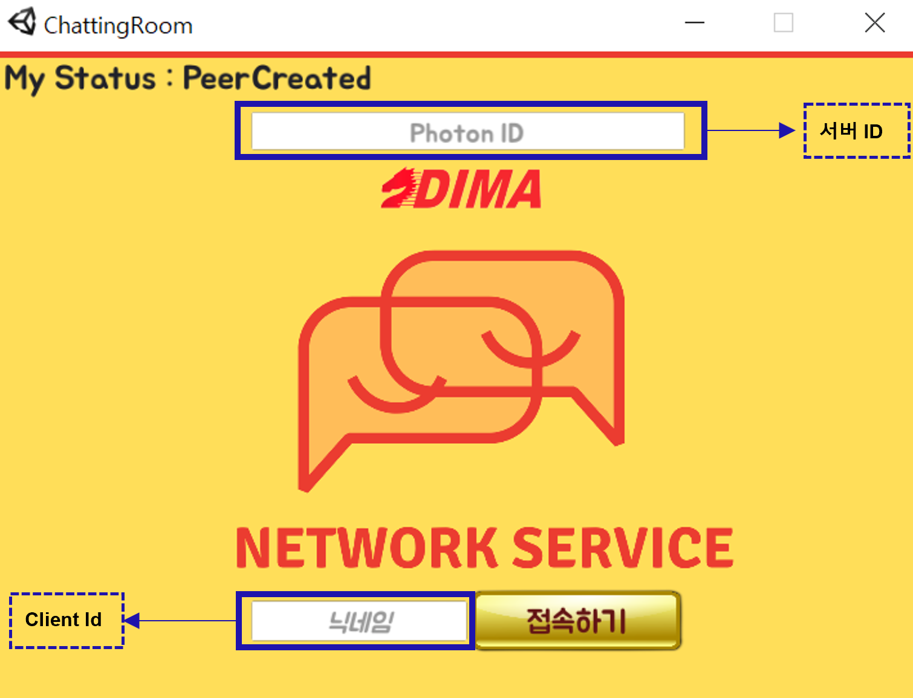
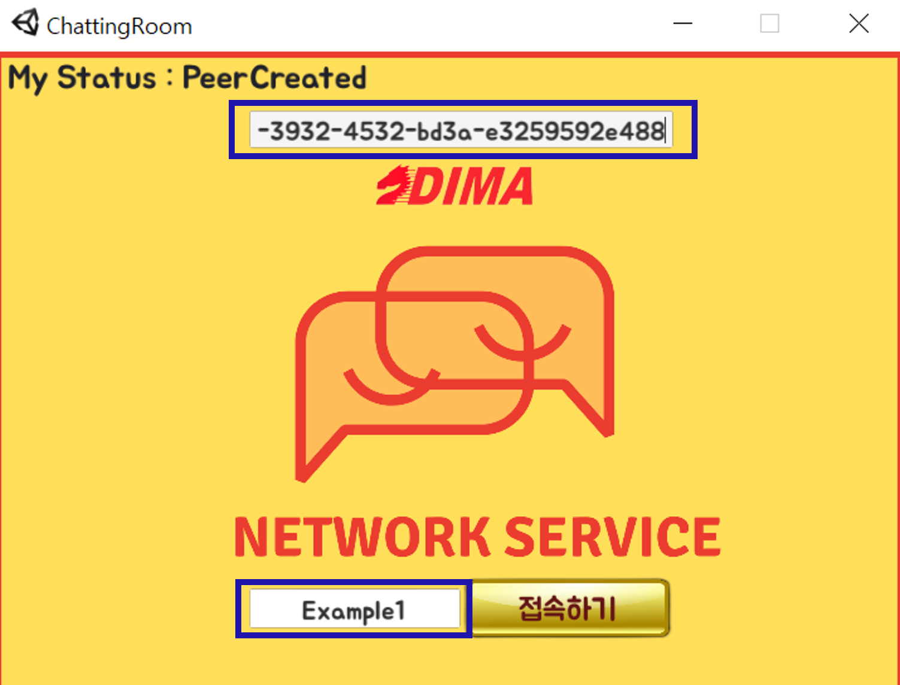
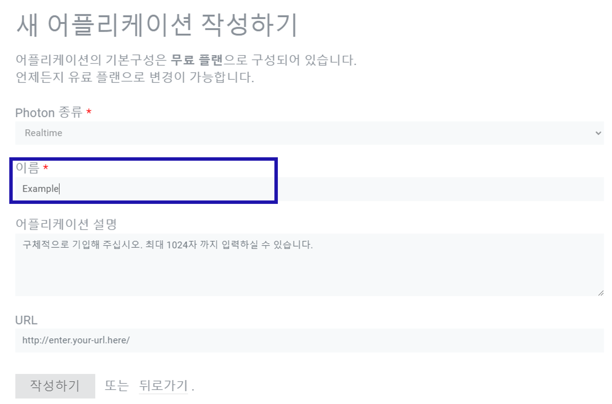
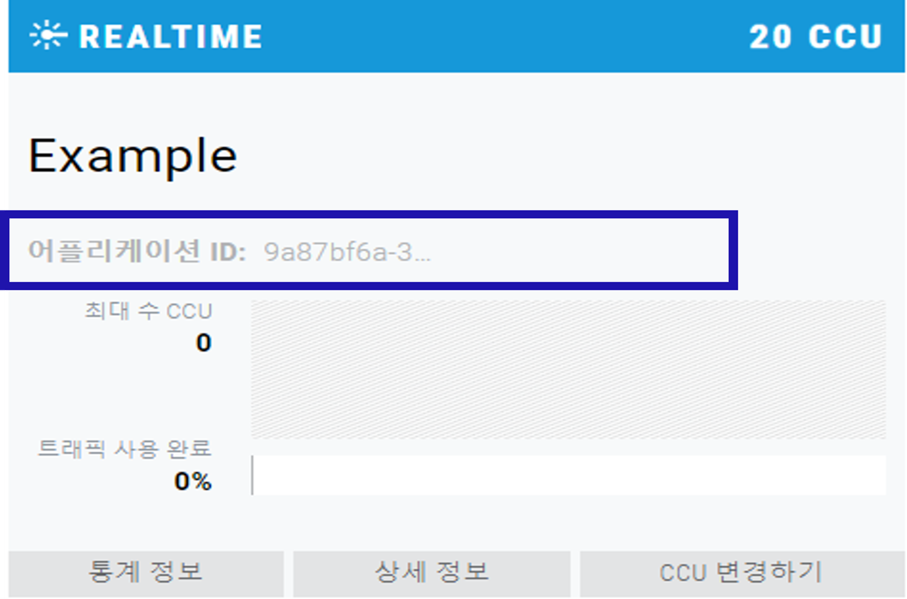
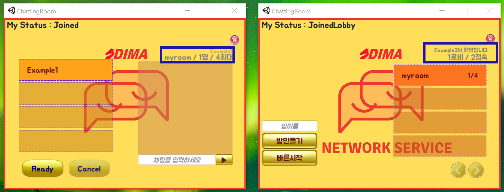
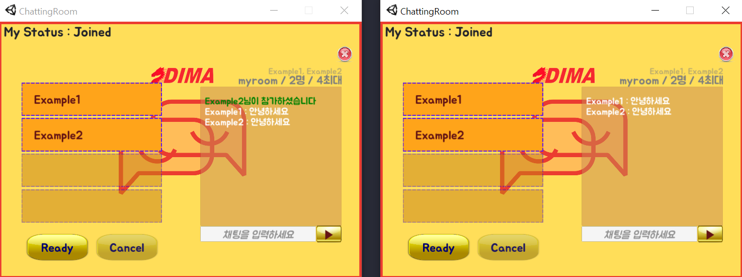
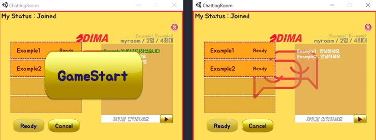

# 게임 대기방 및 채팅 어플리케이션

> Unity Pun Cloud를 통한 서버 구축

멀티플레이어 게임용 unity 패키지 [Photon Unity Networking(PUN)](https://www.photonengine.com/ko-KR/Photon)을 활용하여 게임을 진행 시키기 위한 사용자 대기 채팅 서버를 개발 하였습니다.
유튜버 [고라니TV](https://www.youtube.com/watch?v=a6MquH2NPRE)님의 소스코드를 기반으로 필요한 기능을 추가 및 수정하여 개발하였습니다.

## Ⅰ) 주요 기능
- 구별 가능한 ID를 사용하여 서버 접속 가능
- 모든 클라이언트는 최대 4인이 입장 가능한 채팅 룸 생성 가능
- 접속한 인원의 ID 확인 가능 및 채팅 보드를 통해 채팅 가능
- 호스트를 포함한 모든 인원이 준비 상태가 된 경우 호스트는 게임 시작 가능 (현재 게임 연결 X)

## Ⅱ) 사용 방법
> 개발 환경
- Uninty 2019.1.1f1 version
- PUN 2 (무료 사용시 최대 20인 접속 제한)
> 사용 언어
- C#

### 1. 프로젝트 다운로드
ChattingRoom.exe 실행
>- Photon 서버 ID , 클라이언트 ID 입력 후 접속 

 

 

[Photon 회원 가입 및 서버 ID 생성](https://www.photonengine.com/ko-KR/Photon)
>- 회원 가입 후, 관리화면에서 서버 ID 생성 가능

 

 

### 2. 로비 접속 및 방 생성 
로비 접속 후 방 생성 가능
>- 한 방당 최대 4인이 접속 가능
>- 총 접속 인원, 방 접속 인원, 로비 접속 인원 시각화

 

 

### 3. 채팅 및 게임 시작 기능
채팅 보드를 통해 클라이언트간의 채팅, 준비 버튼 활성활을 통한 게임 대기
>- 채팅 보드를 통한 채팅 기능
>- 모든 클라이언트의 준비 동작시 호스트가 게임 시작 가능

 

 